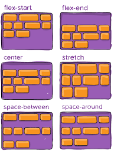

# css notetaking

## css -centering a div

div always take up all the spaces available horizontally.

spans only take up as much space as needed

## float right

floats to the right of the parent element

```
<span style="float: right">
```

but this is dumb way of doing it. positioning shoudl be done by flex box


## display: flex

to position the children of the div right next to each other
